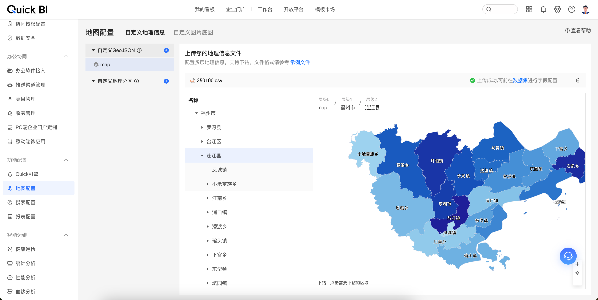

# GeoJSONToCSVConverter



## 使用说明

1. 安装依赖包：

    ```sh
    pip install -r requirements.txt
    ```

2. 运行转换脚本：

    ```sh
    python json2csv.py
    ```

3. 生成的 350100.csv 文件将保存在项目根目录下。

## 目录说明

- **json2csv.py**：主脚本文件，包含转换逻辑

## 数据来源

- [POI数据](https://www.poi86.com/)
